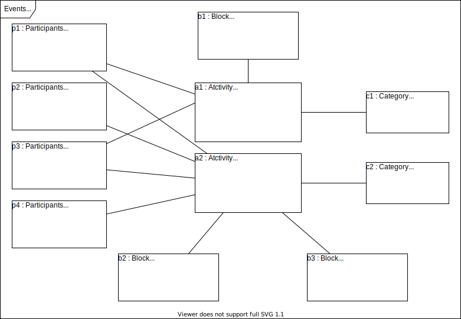

&#xa0;

<h1 align="center">Modeling</h1>

- :heavy_check_mark: Music system.

> Design a System to manage the information of the participants of the activities of an academic event. The activities of this event can be, for example, lectures, courses, practical workshops, etc. Each activity that occurs has a name, description, price, and can be divided into several blocks of time (for example: an HTML course can take place in two blocks, being necessary to store the day and the start and end times of the block for that day). For each participant, you want to register your name and email.

> Minimum instance: 2 activities, 4 participants, at least one activity with more than one block of schedules.

Made with :heart: by <a href="https://github.com/jocile" target="_blank">Jocile</a>

&#xa0;

[Readme.md](../README.md) | <a href="#top">Back to top</a>
