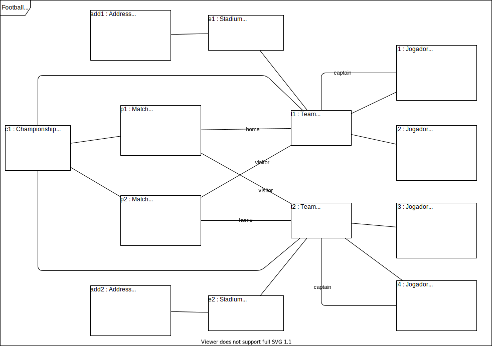

&#xa0;

<h1 align="center">Modeling</h1>

- :heavy_check_mark: Footballs system.

> Design a system to manage the information of championships of football, which take place every year. You want to know the name, date of birth, gender and height of the players of each team, as well as which one is the captain of each team. Each championship match takes place in a stadium, which has a name and address. Each team has its home stadium and, thus, each match has a home team (host) and a visiting team. The system must be able to list the matches already held and not held of a championship. The system must also be able to list the championship table, ordering the teams by classification, which is calculated first by win balance and second by goal difference.

> Minimum instance: 1 championship, 2 matches, 2 teams, 2 players on each team.

Made with :heart: by <a href="https://github.com/jocile" target="_blank">Jocile</a>

&#xa0;

[Readme.md](../README.md) | <a href="#top">Back to top</a>
