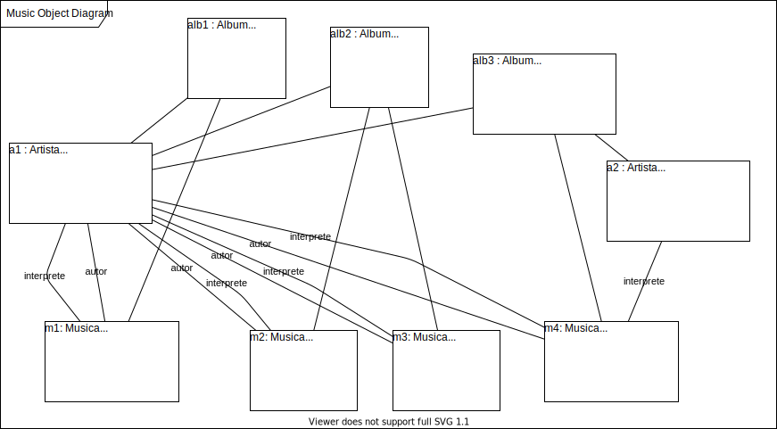

&#xa0;

<h1 align="center">Modeling</h1>

- :heavy_check_mark: Music system.

> Design a System for keeping a record of musical artists and their albums. Each album has several songs, which can be consulted by the system. The system it should also allow searching for artists by name or nationality. The system must also be able to display a report of an artist's albums, which can be sorted by name, year, or duration album total. An album can have the participation of several artists, without distinction. Now the music can have one or more authors and performers (all considered artists).

> Minimum Instance: 2 artists, 3 albums, 4 songs.

Made with :heart: by <a href="https://github.com/jocile" target="_blank">Jocile</a>

&#xa0;

[Readme.md](../README.md) | <a href="#top">Back to top</a>
