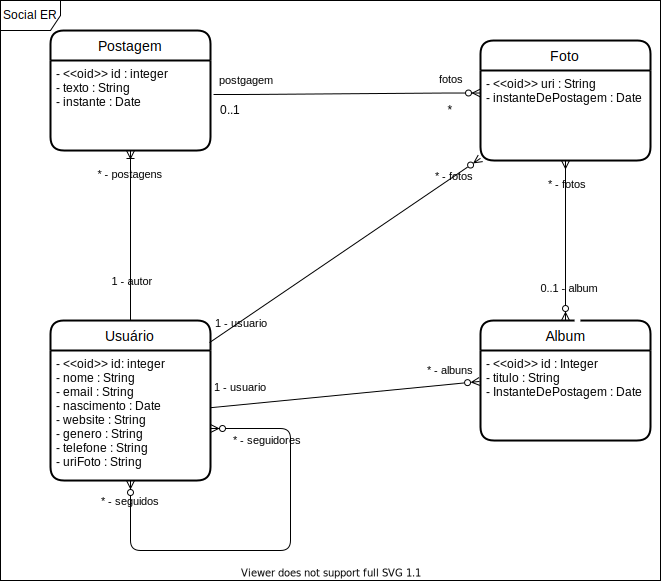

<div align="center" id="top"> 
  

&#xa0;

  <!-- <a href="https://modelagem.netlify.app">Demo</a> -->
</div>

<h1 align="center">Modeling</h1>

<p align="center">
  

  

  

  

  <!--  -->

  <!--  -->

  <!--  -->
</p>

<!-- Status -->

<!-- <h4 align="center">
	🚧  Modelagem 🚀 Under construction...  🚧
</h4>

<hr> -->

<p align="center">
  <a href="#dart-about">About</a> &#xa0; | &#xa0; 
  <a href="#sparkles-features">Features</a> &#xa0; | &#xa0;
  <a href="#rocket-technologies">Technologies</a> &#xa0; | &#xa0;
  <a href="#white_check_mark-requirements">Requirements</a> &#xa0; | &#xa0;
  <a href="#checkered_flag-starting">Starting</a> &#xa0; | &#xa0;
  <a href="#memo-license">License</a> &#xa0; | &#xa0;
  <a href="https://github.com/jocile" target="_blank">Author</a>
</p>

<br>

## :dart: About

Entity and Relationship Modeling Exercises from [DevSuperior](https://devsuperior.com.br/) course.

## :sparkles: Features

:heavy_check_mark: Entity relationship diagrams;\
:heavy_check_mark: Class diagrams;\
:heavy_check_mark: Object diagrams;

## :rocket: Technologies

The following tools were used in this project:

- [Diagrams.net](https://app.diagrams.net/)
- [VSCode IDE](https://code.visualstudio.com/docs/editor/vscode-web)
- [Draw.io Integration](https://marketplace.visualstudio.com/items?itemName=hediet.vscode-drawio)

## :white_check_mark: Requirements

To get started :checkered_flag: Modeling can be done online in the browser or using the IDE with the extension Draw.io.

## :checkered_flag: Starting

```
# Modeling
Access https://app.diagrams.net/
```

## :checkered_flag: Diagrams

- :heavy_check_mark: Social network system.

> In this social network, users can follow and be followed by other users. The user's profile must allow the registration of name, email, date of birth, website, gender, phone and profile picture. Users can make text posts on their own "timeline" (timeline) of the social network, and they can also attach photos to the posts. A photo is referenced by the URI of its storage location. The photos can be organized into albums, with each album having a title.



## :checkered_flag: More Diagrams

- :heavy_check_mark: [Social Object Diagram](SocialNetworkDiagrams/SocialObjectDiagram.md)

> Minimum instance: 4 users, at least one user with more than one post, at least one album with more than one photo.

- :heavy_check_mark: [Music System Diagrams](MusicDiagrams/MusicDiagram.md)

> Design a System for keeping a record of musical artists and their albums. Each album has several songs, which can be consulted by the system. The system it should also allow searching for artists by name or nationality. The system must also be able to display a report of an artist's albums, which can be sorted by name, year, or duration album total. An album can have the participation of several artists, without distinction. Now the music can have one or more authors and performers (all considered artists).

> Minimum Instance: 2 artists, 3 albums, 4 songs.

## :memo: License

This project is under license from MIT. For more details, see the [LICENSE](LICENSE.md) file.

Made with :heart: by <a href="https://github.com/jocile" target="_blank">Jocile</a>

&#xa0;

<a href="#top">Back to top</a>
