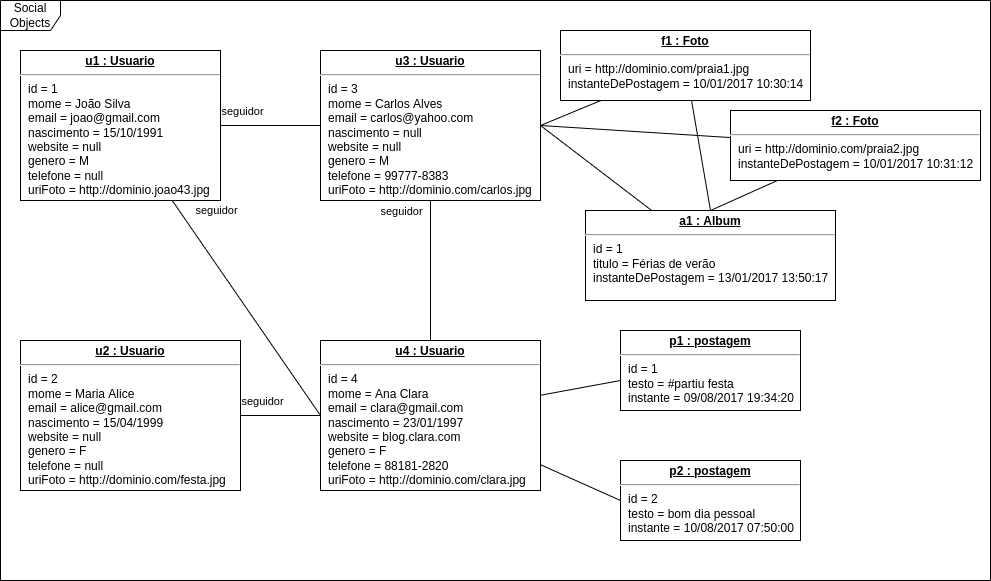

&#xa0;

<h1 align="center">Modeling</h1>

- :heavy_check_mark: Social network system.

> In this social network, users can follow and be followed by other users. The user's profile must allow the registration of name, email, date of birth, website, gender, phone and profile picture. Users can make text posts on their own "timeline" (timeline) of the social network, and they can also attach photos to the posts. A photo is referenced by the URI of its storage location. The photos can be organized into albums, with each album having a title.

> Minimum instance: 4 users, at least one user with more than one post, at least one album with more than one photo.

Made with :heart: by <a href="https://github.com/jocile" target="_blank">Jocile</a>

&#xa0;

[Readme.md](../README.md) | <a href="#top">Back to top</a>
